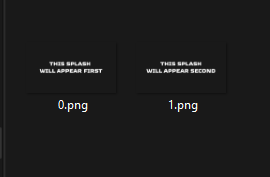

# GameSplash

Want to add a splash screen before starting your game? This can be done in less than a minute.\
Splashes can be skipped by pressing any key on the keyboard, mouse or controller.

# Sample
In your main function, instead of setting your GameState directly, pass it through the GameSplash class.
```c++
#include <Stellar/Stellar.h>

#include <Stellar/Render/GameSplash.h>
#include "Menu/StateMainMenu.h"

using namespace Stellar;

int main()
{
	Game::Get().SetSettings({ "Stellar Game" });
	Game::Get().SetState<GameSplash<StateMainMenu>>();
	Game::Get().Run();
	return 0;
}
```
That's all you need code-wise!\
To change the splashes and their order, you'll need to head over to your `/Assets/Splash/` folder and if you're using this sample, you'll already see 2 splashes.\
The order in which they appear is decided by their file name, 0 being first, 1 being second etc.\
There's no limit to how many you can show.



> [!NOTE]
> Spritesheets and video playback are not supported by default.\
> You can also optionally use `#ifdef STELLAR_DEBUG` to check if you're in Debug mode and disable the GameSplash if you don't want to play it everytime when testing your game.