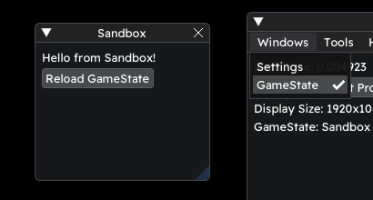

# GameState

Probably the most important thing in the framework, it allows you to have access to essential functions like Load, Update, Draw etc.\
There are also some optional functions such as `OnResize` which is called when the game window is resized (you can make your UI resizable that way), `OnEvent` which is called for every SFML event, `OnKeyPressed`, `OnMousePressed`, `OnJoyPressed`, `OnJoyMoved` are all various input events and are better for handling UI rather than player movement.

# Sample

Header:
```c++
#ifndef STATE_SANDBOX_H
#define STATE_SANDBOX_H

#include <Stellar/Stellar.h>

class StateSandbox : public Stellar::GameState
{
public:
    StateSandbox()
        : GameState("Sandbox") {}

    void Load() override;
    //void OnResize(sf::Vector2u _size) override {}
    //void OnEvent(sf::Event _event) override {}
	//void OnKeyPressed(sf::Event::KeyEvent _key) override {}
	//void OnMousePressed(sf::Event::MouseButtonEvent _mouse) override {}
	//void OnJoyPressed(sf::Event::JoystickButtonEvent _joy) override {}
	//void OnJoyMoved(sf::Event::JoystickMoveEvent _joy) override {}
    void Update(float _deltaTime) override;
    void UpdateImGui(float _deltaTime) override;
    void Draw(sf::RenderTexture& _texture) override;

private:
    sf::RectangleShape shape;
};

#endif
```

Source:
```c++
#include "StateSandbox.h"

void StateSandbox::Load()
{
    shape.setSize({ 32.f, 32.f });
}

void StateSandbox::Update(float _deltaTime)
{
    std::cout << "Updating" << std::endl;
}

void StateSandbox::UpdateImGui(float _deltaTime)
{
    ImGui::Text("Hello from Sandbox!");
}

void StateSandbox::Draw(sf::RenderTexture& _texture)
{
    _texture.draw(shape);
}
```

# UpdateImGui
You may have seen this function in the sample, it's an optional function that acts a lot like a [DebugTool](DebugTools.md) but is only accessible in your current GameState.\
So if you need a button to heal your player or to pause your game, this may be the best place to do so.\
You'll also find a button named `Reload GameState`, this button is always there and just calls your `Load` and `OnResize` functions

